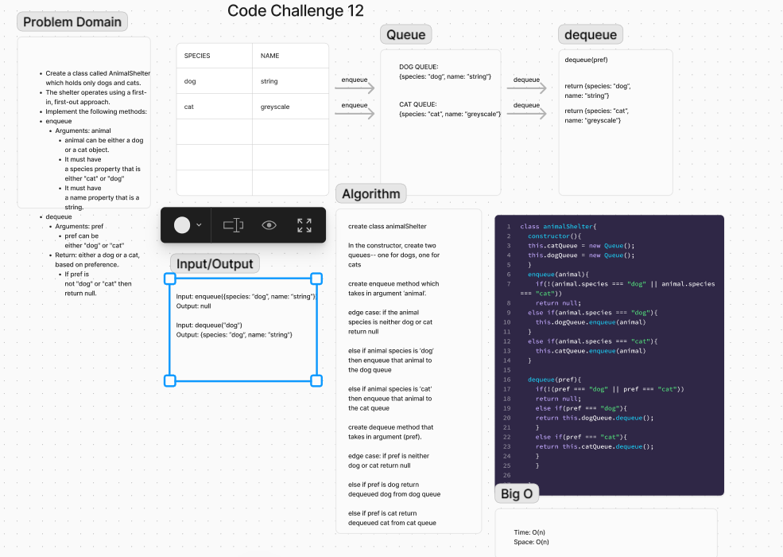

# Animal Shelter


## Summary
The `AnimalShelter` class is designed to manage a shelter for cats and dogs. Animals can be enqueued or dequeued based on their species. The class maintains separate queues for cats and dogs and provides methods to add animals to the shelter and retrieve them based on preference.

## Description
The `AnimalShelter` class includes the following methods:
- `enqueue(animal)`: Adds an animal to the appropriate queue based on its species.
- `dequeue(pref)`: Removes and returns an animal from the queue corresponding to the specified preference (either "cat" or "dog"). Returns `null` if the preference is not valid.

## Whiteboard


## Approach & Efficiency
- **Data Structures**: Utilizes two queues to handle cats and dogs separately.
- **Time Complexity**:
  - `enqueue`: O(1) for adding an animal to the queue.
  - `dequeue`: O(1) for retrieving an animal from the queue, assuming the queue operations are O(1).

## Solution
Here is the implementation of the `AnimalShelter` class:

```javascript
const { Queue } = require('./Queue.js');

class AnimalShelter {
  constructor() {
    this.catQueue = new Queue();
    this.dogQueue = new Queue();
  }

  enqueue(animal) {
    if (!(animal.species === "dog" || animal.species === "cat"))
      return null;
    else if (animal.species === "dog") {
      this.dogQueue.enqueue(animal);
    } else if (animal.species === "cat") {
      this.catQueue.enqueue(animal);
    }
  }

  dequeue(pref) {
    if (!(pref === "dog" || pref === "cat"))
      return null;
    else if (pref === "dog") {
      return this.dogQueue.dequeue();
    } else if (pref === "cat") {
      return this.catQueue.dequeue();
    }
  }
}

module.exports = { AnimalShelter };
