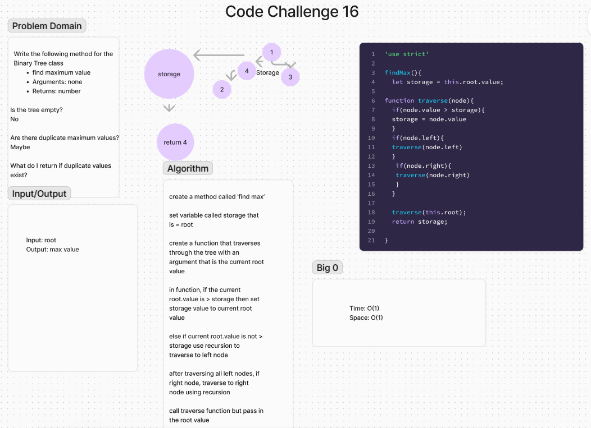

# Binary Tree Data Structure


## Summary
The `BinaryTree` class provides methods for tree traversal (pre-order, in-order, post-order) and a method to find the maximum value in the tree. This class helps in understanding basic tree operations, traversal techniques, and finding specific values in a binary tree.

## Whiteboard


## Description
The `BinaryTree` class includes the following methods:
- `preOrder()`: Returns a collection of values visited in pre-order traversal.
- `inOrder()`: Returns a collection of values visited in in-order traversal.
- `postOrder()`: Returns a collection of values visited in post-order traversal.
- `findMax()`: Returns the maximum value in the tree.

### Traversal Definitions
- **Pre-order Traversal**: Visit the root node, then traverse the left subtree, and finally traverse the right subtree.
- **In-order Traversal**: Traverse the left subtree, visit the root node, and then traverse the right subtree.
- **Post-order Traversal**: Traverse the left subtree, traverse the right subtree, and then visit the root node.

## Approach & Efficiency
- **Data Structures**: Utilizes a binary tree structure where each node has a value, and pointers to left and right children.
- **Time Complexity**:
  - `preOrder()`, `inOrder()`, `postOrder()`: O(n), where n is the number of nodes in the tree, as each node is visited once.
  - `findMax()`: O(n), where n is the number of nodes in the tree, as each node is visited to find the maximum value.

## Solution
Here is the implementation of the `BinaryTree` class:

```javascript
// Binary Tree class
class BinaryTree {
  constructor() {
    this.root = null;
  }

  // Pre-order traversal
  preOrder() {
    let result = [];
    function traverse(node) {
      result.push(node.value);
      if (node.left) traverse(node.left);
      if (node.right) traverse(node.right);
    }
    traverse(this.root);
    return result;
  }

  // In-order traversal
  inOrder() {
    let result = [];
    function traverse(node) {
      if (node.left) traverse(node.left);
      result.push(node.value);
      if (node.right) traverse(node.right);
    }
    traverse(this.root);
    return result;
  }

  // Post-order traversal
  postOrder() {
    let result = [];
    function traverse(node) {
      if (node.left) traverse(node.left);
      if (node.right) traverse(node.right);
      result.push(node.value);
    }
    traverse(this.root);
    return result;
  }

  // Find maximum value in the tree
  findMax() {
    if (!this.root) throw new Error("Tree is empty");

    let maxValue = this.root.value;
    function traverse(node) {
      if (node.value > maxValue) {
        maxValue = node.value;
      }
      if (node.left) traverse(node.left);
      if (node.right) traverse(node.right);
    }
    traverse(this.root);
    return maxValue;
  }
}

module.exports = { BinaryTree };
