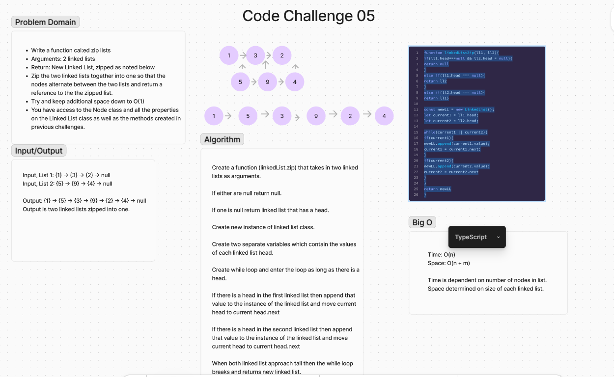

# Code Challenge 05: Zip Lists
<!-- Description of the challenge -->
Write a function called `zipLists` that takes in two linked lists and zips them together into one so that the nodes alternate between the two lists and return a reference to the new zipped list.

## Whiteboard Process


## Approach & Efficiency
### Approach
1. Create a function `linkedListZip` that takes in two linked lists as arguments.
2. If either list is null, return null.
3. If one list is null, return the list that has a head.
4. Create a new instance of the linked list class.
5. Create two separate variables that contain the values of each linked list head.
6. Create a while loop and enter the loop as long as there is a head.
7. If there is a head in the first linked list, append that value to the instance of the linked list and move the current head to `current.head.next`.
8. If there is a head in the second linked list, append that value to the instance of the linked list and move the current head to `current.head.next`.
9. When both linked list approaches null, then the while loop breaks and returns the new linked list.

### Efficiency
- **Time Complexity**: O(n + m) - where `n` and `m` are the lengths of the two linked lists. The time is dependent on the number of nodes in the lists.
- **Space Complexity**: O(1) - Additional space used is constant and does not grow with the size of the input lists.

## Solution
To run the solution, follow these steps:

1. Clone the repository.
2. Ensure you have Node.js installed.
3. Install dependencies (if any) using `npm install`.
4. Create a file `LinkedList.js` and include the following code:

```javascript
'use strict';

class Node {
  constructor(value) {
    this.value = value;
    this.next = null;
  }
}

class LinkedList {
  constructor() {
    this.head = null;
  }

  insert(value) {
    let newHead = new Node(value);
    newHead.next = this.head;
    this.head = newHead;
  }

  append(value) {
    let newNode = new Node(value);
    if (!this.head) {
      this.head = newNode;
      return;
    }
    let current = this.head;
    while (current.next) {
      current = current.next;
    }
    current.next = newNode;
  }

  includes(targetValue) {
    let current = this.head;
    while (current !== null) {
      if (current.value === targetValue) return true;
      current = current.next;
    }
    return false;
  }

  toString() {
    let current = this.head;
    let list = '';
    while (current !== null) {
      list += `{ ${current.value} } -> `;
      current = current.next;
    }
    return list + 'NULL';
  }

  static linkedListZip(ll1, ll2) {
    if (ll1.head === null && ll2.head === null) {
      return null;
    } else if (ll1.head === null) {
      return ll2;
    } else if (ll2.head === null) {
      return ll1;
    }

    const newLL = new LinkedList();
    let current1 = ll1.head;
    let current2 = ll2.head;

    while (current1 || current2) {
      if (current1) {
        newLL.append(current1.value);
        current1 = current1.next;
      }
      if (current2) {
        newLL.append(current2.value);
        current2 = current2.next;
      }
    }
    return newLL;
  }
}

module.exports = LinkedList;
